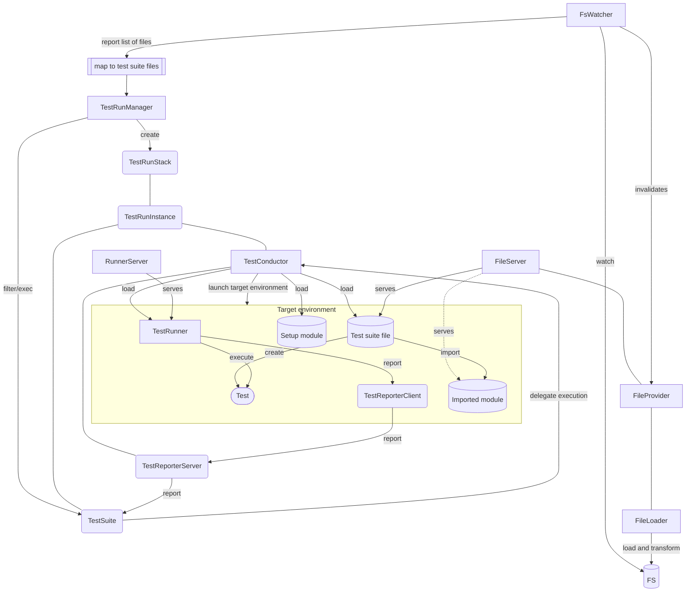

# Toolbox

Collection of loosely coupled units for testing libraries in multiple environments.

## Usage

Each unit is designed to be replaceable if your project or environment requires a different setup.
For the "default" usage there are setup functions that reduce the boilerplate.

```js
import { setupSourceModuleLoader, setupToolboxTester, setupNodeConductor, setupChromeConductor, serveDir } from '@ph.fritsche/toolbox'

const tester = await setupToolboxTester(
    [ // Watched files
        'src',
        'test'
    ],
    [ // Test coductors
        setupNodeConductor('Node, Dependency version X', [
            new URL('http://path/to/setup/fileX.js'),
        ]),
        setupNodeConductor('Node, Dependency version Y', [
            new URL('http://path/to/setup/fileY.js'),
        ]),
        setupChromeConductor('Chrome, Dependency version X', [
            new URL('http://path/to/setup/fileX.js'),
        ]),
    ],
    [ // Loaders which e.g. transform TS to JS
        await setupSourceModuleLoader()
    ],
)

// Run the tests with each of the conductors and report combined results
await tester.start()
```

## Design

